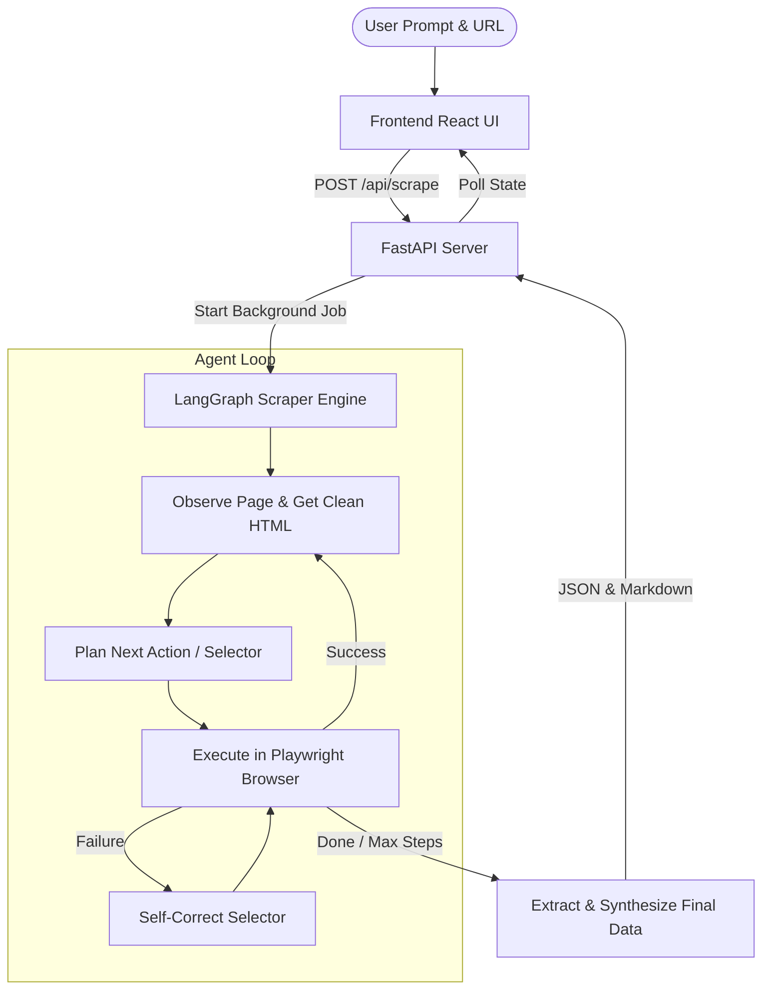

# Self-Correcting Agentic Web Scraper

An intelligent, self-correcting web crawler and scraper built using an agentic design pattern. The application uses a LangGraph-coordinated state machine backend to autonomously navigate websites, scrape relevant pages, self-correct navigation failures, and synthesize highly comprehensive, structured responses based on a user's natural language objective.

---

## 🌟 Features

- **Agentic Multi-Page Crawling**: Unlike traditional static scraper scripts, this agent dynamically plans navigation steps, clicks selectors, and follows relevant links across multiple pages to compile a complete corpus of information.
- **Self-Correction & Fallback**: If a browser selector fails or navigation times out, the backend agent catches the error, documents the failure, and updates its strategy in the next plan iteration to avoid getting stuck.
- **LangGraph Coordination**: Coordinates scraping states via a custom state machine logic:
  `Observe Page` ➔ `Plan Action` ➔ `Execute Action` ➔ `Self-Correct (on error)` ➔ `Extract & Synthesize (on completion)`.
- **Dynamic Playwright Automation**: Utilizes Playwright to automate interactions with modern Single Page Applications (SPAs) and heavy JavaScript client-side routing.
- **Clean Content Synthesis**: Automatically cleans HTML snapshots to fit within context limits, scrapes body text, and uses GPT-based reasoning to generate:
  1. A beautifully detailed, human-readable Markdown answer.
  2. A clean, structured JSON dataset mapping the user's requested data points.
- **Premium Live Dashboard**: A modern React-based frontend showing live progress updates, current crawler status, step-by-step history, and side-by-side Markdown response and raw JSON outputs.

---

## 🏗️ System Architecture



### Backend Flow Components
1. **Observe Node (`observe_node`)**: Navigates to target pages, gathers structural snapshots, cleans noisy elements (like script/style tags), and updates the state snapshot.
2. **Plan Node (`plan_node`)**: Evaluates the objective, the current URL, already extracted pages, and past failed steps to decide the next action (`click`, `type_text`, `extract_page_content`, or `finish_and_synthesize`).
3. **Execute Node (`execute_node`)**: Interacts with Playwright to perform the action and updates step history.
4. **Correct Node (`correct_node`)**: Generates replacement selectors or alternative actions if an element was missing or unresponsive.
5. **Extract Node (`extract_node`)**: Feeds all accumulated text snippets from crawled pages into the LLM to output structured markdown and JSON formats.

---

## 🛠️ Technology Stack

### Backend
- **Python 3.11**
- **FastAPI**: Lightweight REST API framework.
- **LangGraph & LangChain**: For agentic state routing, planning prompts, and LLM integrations.
- **Playwright**: Modern browser automation tool.
- **BeautifulSoup4**: HTML parsing and cleaning.
- **OpenAI GPT Models**: Powers the planner, correction, and synthesis nodes.

### Frontend
- **React & Vite**: Extremely fast modern web app build tool.
- **Vanilla CSS**: Clean, premium responsive layouts.

---

## 🚀 Setup & Installation

### Prerequisites
- Python 3.11+
- Node.js (v18+)
- OpenAI API Key

### 1. Backend Setup
1. Navigate to the backend directory:
   ```bash
   cd backend
   ```
2. Create and activate a Python virtual environment:
   ```bash
   python -m venv venv
   # On Windows:
   .\venv\Scripts\activate
   # On Unix/macOS:
   source venv/bin/activate
   ```
3. Install dependencies:
   ```bash
   pip install -r requirements.txt
   ```
4. Install Playwright browser engines:
   ```bash
   playwright install chromium
   ```
5. Create a `.env` file in the `backend` folder and add your OpenAI API Key:
   ```env
   OPENAI_API_KEY=your_openai_api_key_here
   ```
6. Start the API server:
   ```bash
   python main.py
   ```
   The backend will run on `http://localhost:8000`.

### 2. Frontend Setup
1. Navigate to the frontend directory:
   ```bash
   cd ../frontend
   ```
2. Install npm dependencies:
   ```bash
   npm install
   ```
3. Start the dev server:
   ```bash
   npm run dev
   ```
   The application dashboard will be live at `http://localhost:5173`.

---

## 📝 License
This project is open-source and available under the [MIT License](LICENSE).
